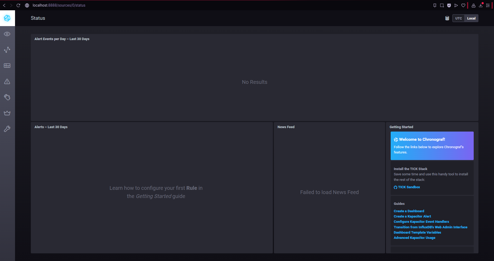
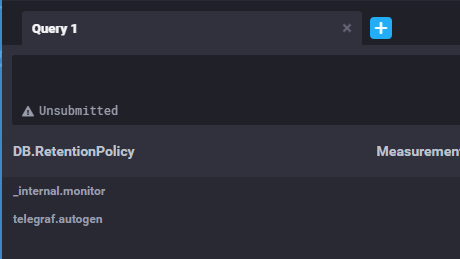

1. Вас пригласили настроить мониторинг на проект. На онбординге вам рассказали, что проект представляет из себя платформу для вычислений с выдачей текстовых отчетов, которые сохраняются на диск. Взаимодействие с платформой осуществляется по протоколу http. Также вам отметили, что вычисления загружают ЦПУ. Какой минимальный набор метрик вы выведите в мониторинг и почему?  
Ответ: CPU usage - Вычисления нагружают процессор, нужно отслеживать перегрузку, Load average - Показывает очередь процессов, ожидающих CPU, RAM usage - Вычисления могут потреблять память, утечки памяти — частая проблема, Disk space - Отчеты сохраняются на диск, диск может переполниться, Disk inodes - Много мелких отчетов могут исчерпать inodes, Service up/down - Проверка — жив ли сервис.  
2. Менеджер продукта посмотрев на ваши метрики сказал, что ему непонятно что такое RAM/inodes/CPUla. Также он сказал, что хочет понимать, насколько мы выполняем свои обязанности перед клиентами и какое качество обслуживания. Что вы можете ему предложить?  
Ответ: Доступность сервиса (Uptime) — % времени, когда сервис работал, Время выполнения запроса (Response Time), Количество успешных вычислений — % успешных HTTP 2xx, Время генерации отчета — сколько времени занимают вычисления.  
3. Вашей DevOps команде в этом году не выделили финансирование на построение системы сбора логов. Разработчики в свою очередь хотят видеть все ошибки, которые выдают их приложения. Какое решение вы можете предпринять в этой ситуации, чтобы разработчики получали ошибки приложения?  
Ответ: Вариант 1 - Loki + Promtail, Вариант 2 - syslog-ng + централизованный сервер.  
4. Вы, как опытный SRE, сделали мониторинг, куда вывели отображения выполнения SLA=99% по http кодам ответов. Вычисляете этот параметр по следующей формуле: summ_2xx_requests/summ_all_requests. Данный параметр не поднимается выше 70%, но при этом в вашей системе нет кодов ответа 5xx и 4xx. Где у вас ошибка?  
Ответ: Нужно учитывать только успешные (2xx) и ошибочные (4xx, 5xx) ответы, но исключать вспомогательные запросы (healthchecks, мониторинг, сканеры, bots).  
5. Опишите основные плюсы и минусы pull и push систем мониторинга.  
Ответ: Плюсы - Проще контролировать сбор метрик, Лучше при короткоживущих сервисах, Можно через NAT, Встроенная валидация данных. Минусы - Нужна доступность targets из мониторинга, Больше сетевых соединений, Медленнее при росте числа метрик, Сложный horizontal scaling.
6. Какие из ниже перечисленных систем относятся к push модели, а какие к pull? А может есть гибридные?  
  
Prometheus - Pull  
TICK - Push  
Zabbix - Push  
VictoriaMetrics - Pull  
Nagios - Pull  
  
7. Задание  
  
  
  
8. Задание  
  
  
  